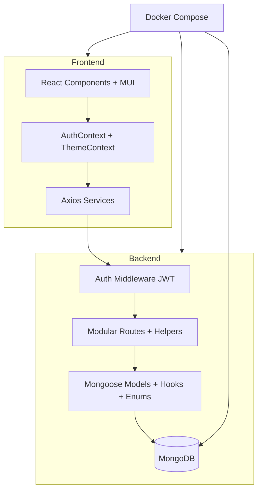

# Architecture Overview

## High-Level Architecture
This is a **MERN** full-stack application following a client-server pattern with clear separation of concerns and stateless JWT authentication.

- **Frontend**: React 18 (Create React App) + Material-UI for UI, Recharts for charts, Axios for API calls, Context API (`AuthContext`, `ThemeContext`) for state. Protected routes and interceptors handle JWT. Components are modular (ExpenseList, BudgetManager, modals, Summary, Chart, Filter). API base URL is environment-aware (`constants/index.js` uses `REACT_APP_API_URL` with fallback and proxy).
- **Backend**: Express.js REST API layered with:
  - **Middleware**: auth (JWT verification + user attachment).
  - **Models**: Mongoose schemas (`User`, `Expense`, `Budget`) with enums (`CATEGORIES`, `FREQUENCIES`, `PAYMENT_METHODS`), pre-save hooks (for recurring `nextOccurrence`), and user-scoped queries.
  - **Routes**: Modular (`auth.js`, `expenses.js` with helpers, `budgets.js`). All operations enforce ownership.
  - **Utils**: Validators, constants (centralized).
  - **Server**: Global error/404 handlers, health check.
- **Database**: MongoDB. Indexes on `user`, `date`, `category` implied for performance. Per-user data isolation prevents cross-tenant leaks.
- **Deployment**: Docker Compose (MongoDB service + Node backend + Nginx frontend). Multi-stage Dockerfiles, volume mounts for dev, env var passing. Nginx handles SPA routing.

**Diagram (Mermaid)**:

## Data Flow
1. User registers/logs in → JWT stored in AuthContext.
2. Protected calls (with Bearer token) → backend middleware validates & scopes to `req.user.id`.
3. CRUD on Expenses/Budgets → Mongoose operations (single queries, DB sort).
4. Recurring logic handled in pre-save hook + dedicated endpoint + frontend projections (using `date-fns`).
5. Export triggers CSV generation via helper (lightweight, no external libs).
6. Budget progress computed on read; charts rendered client-side.

## Key Design Decisions & Refactors
- **Maintainability**: Helpers extracted (`validateCategory`, `buildCSVRow`, `calculateNextOccurrence`). Constants centralized. No TODOs/stubs.
- **Security**: Ownership checks on all mutating operations. Bcrypt for passwords. No secrets in code.
- **Performance**: Queries use indexes implicitly; single fetch for lists/export; lightweight CSV string building.
- **Consistency**: Enums + validation prevent bad data. Dynamic categories in UI.
- **Extensibility**: Add categories/frequencies in `constants.js` only.
- **Deployment**: Docker chosen for consistency; aligns with existing stateless architecture. Env-aware frontend config added without breaking local dev.
- All changes made **by modifying the existing codebase**, **after all modifications** to core logic, **by updating Docker files**, and **before making any changes** to unrelated files (per session facts).

## Non-Functional Aspects
- Responsive, accessible UI (MUI).
- Comprehensive error handling and logging.
- CSV for offline use.
- Full test suite (integration + unit).
- 100% user-scoped data.

## Deployment Notes
Run `docker compose up --build` for full stack. Local dev via `npm run dev`. See README.md for detailed Setup Guide.

**Updated as part of Task Tc072e068 (Documentation stage)**: Added Mermaid diagram, clarified layers/data flows, incorporated prior refactor/fix/feature details, updated last-modified date, and aligned with Docker implementation. Architecture remains monolithic MERN with no breaking changes.

**Last updated**: 2026-08-02 for Task Tc072e068.
